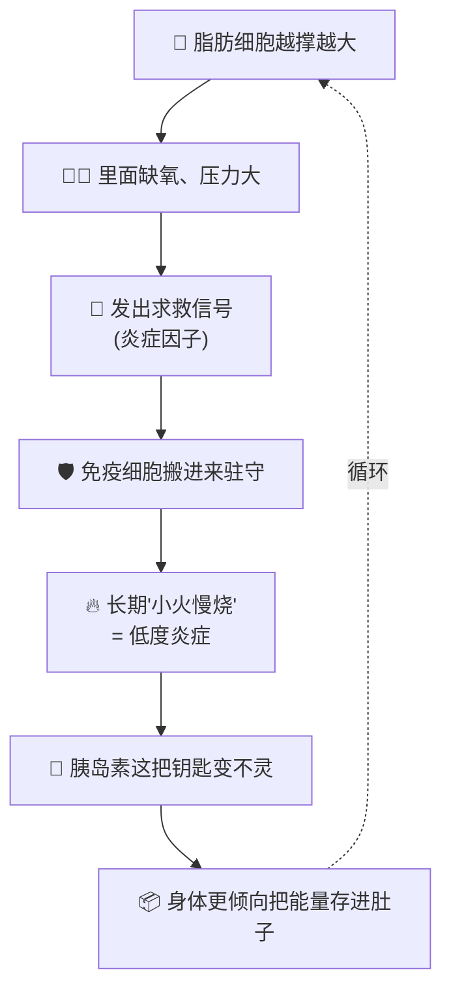

# 食物敏感 × 炎症 × 内脏脂肪

> [!abstract] 一句话结论（给团队）
> **"内脏脂肪 ↔ 炎症" 这一段有扎实研究；"食物敏感 → 炎症 → 变胖" 这条完整链条，目前还接不起来。**
> 我们的故事要讲清楚：哪一段站得住、哪一段还只是假说。

---

## 🗺️ 整体链条：哪一段站得住？

| 链接 | 红绿灯 | 白话 |
|---|---|---|
| 内脏脂肪 → 炎症指标升高 | 🟢 | 人体研究一致看到；减掉内脏脂肪，部分炎症指标也跟着改善 |
| 炎症 → 更容易囤肚子 | 🟡 | 机制说得通（胰岛素变不灵），但不是"先抗炎才能减脂" |
| 肠漏 → 炎症 / 肥胖 | 🟡 | 小鼠实验多；8 项人体研究汇总：**没有一致证据** |
| 食物 IgG 阳性 → 身体在发炎 | 🔴 | IgG 更像"吃过的记录"，过敏学会不建议用来诊断 |

> [!warning] 方向很重要
> 研究看到的主要方向是 **"脂肪多 → 炎症多"**，而不是 **"食物敏感 → 炎症 → 变胖"**。
> 这点决定了我们对外能怎么说。

---

## 🎬 故事分 6 幕（之后直接变成动画分镜）

### 第 0 幕｜Hook：我明明很努力
- 画面：一个人认真吃饭、早睡，但腰腹变圆、饭后胀、脸肿
- 旁白：*"不是你不够自律，而是网上的解释太顺了。"*

### 第 1 幕｜网络上流行的"完美故事"
- 画面：多米诺骨牌 🁢 食物敏感 → 肠漏 → 全身发炎 → 肚子胖
- 重点：故事很顺，所以很有说服力

### 第 2 幕｜我们逐块检查骨牌 🟢🟡🔴
- 画面：每块骨牌亮起红绿灯（用上面的表）
- 重点：有的骨牌是实心的，有的是纸糊的

### 第 3 幕｜真正站得住的机制：内脏脂肪是个"挤爆的宿舍" 🏠
用比喻讲机制，不讲术语：

- **为什么是内脏脂肪，不是皮下脂肪？** 内脏脂肪离肝脏近，信号"直达"肝脏和代谢系统（比喻：住在总部隔壁的吵闹邻居）
- **好消息**：内脏脂肪下降 → 部分炎症指标改善（人体一年随访）

### 第 4 幕｜"食物敏感"到底是什么？三种不一样的东西
| | 🚨 食物过敏 | 😣 食物不耐受 | 📋 IgG 阳性 |
|---|---|---|---|
| 比喻 | 警报系统误判 | 工厂缺某个工人（例：乳糖酶） | 访客登记簿 |
| 机制 | IgE 抗体 | 消化问题 | 吃过就可能有记录 |
| 能诊断？ | ✅ 医生可测 | ✅ 有方法 | ❌ 不能单独证明"有害" |

> [!note] 新线索（要讲得公平）
> 2025 年一项随机双盲试验：**已确诊 IBS** 的人，用**特别设计的 18 种食物 IgG 检测**调整饮食，腹痛改善比例较高。
> ⚠️ 只限这群人、这个检测；不代表普通 IgG 套组有效，也没证明 IgG 是病因。

### 第 5 幕｜肠道那道"门"
- 小鼠：高脂饮食 → 细菌碎片进入血液 → 炎症（这是"肠漏"故事的来源）
- 人体：空腹时肥胖者的肠道通透性**没有明显比较高**；系统综述结论 = 不一致
- 一句话：**值得研究，但还不能拿来解释你的肚子**

### 第 6 幕｜所以呢？给普通人 & 给我们团队
- 👤 给消费者：记录 4 件事 → 哪里不舒服／几点开始／之前吃了什么／会不会重现
- 🧑‍💼 给团队：见下方"能说 vs 不能说"

---

## ✅❌ 对外沟通：能说 vs 不能说

| ✅ 可以说 | ❌ 避免说 |
|---|---|
| 内脏脂肪与身体的炎症指标有关 | 食物敏感会让你变胖 |
| 减少内脏脂肪，部分炎症指标会改善 | 先抗炎才能减肚子 |
| 饮食、睡眠、活动可持续最重要 | IgG 测试能找出让你发炎的食物 |
| 不适值得记录、和专业人员讨论 | 肠漏是你所有症状的根源 |

---

## 📅 分阶段计划

- [x] **Phase 1｜架构**（本文件）→ 团队确认故事主线
- [ ] **Phase 2｜补证据 + 脚本**：每幕配 1–2 篇核心文献、写旁白稿、画分镜草图
- [ ] **Phase 3｜做成可视化**：选一个 → 互动网页（JavaScript，可点红绿灯看证据） / 动态图形短视频（60–90 秒）

---

## 📚 目前引用的来源
- [人体脂肪与炎症指标](https://pubmed.ncbi.nlm.nih.gov/35232676/) · [内脏脂肪变化与炎症指标](https://pubmed.ncbi.nlm.nih.gov/36416291/) · [综述](https://pubmed.ncbi.nlm.nih.gov/36575472/)
- [肠道脂质刺激研究](https://pubmed.ncbi.nlm.nih.gov/29984492/) · [肠道通透性人体系统综述](https://pubmed.ncbi.nlm.nih.gov/36079905/)
- [AAAAI：IgG 食物检测说明](https://www.aaaai.org/tools-for-the-public/conditions-library/allergies/igg-food-test) · [IBS 随机试验 2025](https://pubmed.ncbi.nlm.nih.gov/39894284/)

> [!todo] 待补证据（第 3 幕机制细节）
> "脂肪细胞缺氧 → 免疫细胞进驻"、"内脏脂肪信号直达肝脏" 这两点目前来自一般医学知识，**Phase 2 需要补上对应论文**再对外用。
