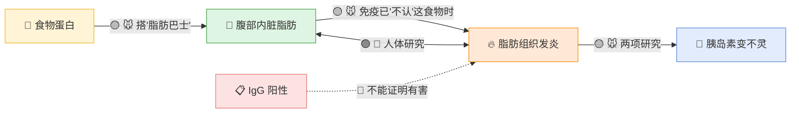
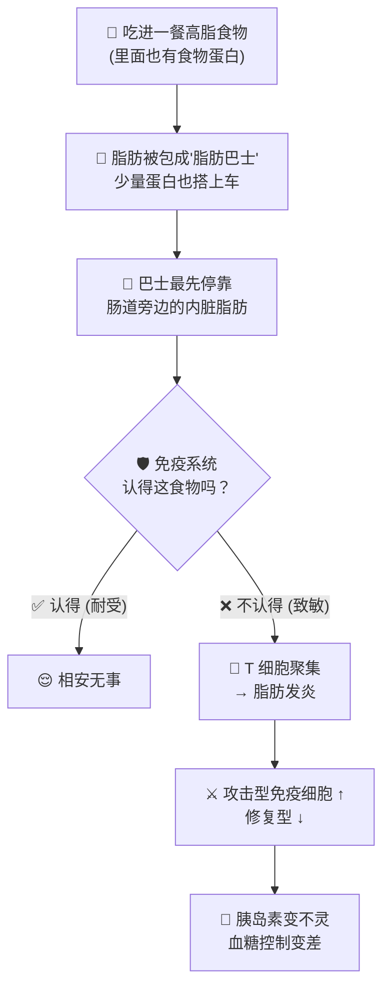
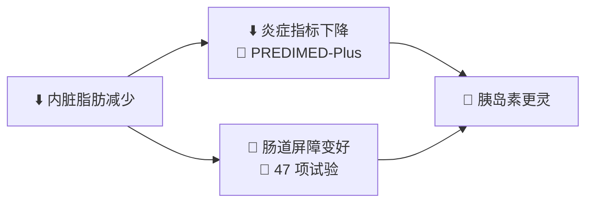

# 食物敏感 × 炎症 × 内脏脂肪

> [!abstract] 一句话结论（给团队）
> **食物免疫反应 → 腹部脂肪发炎 → 血糖控制变差：这条路在老鼠身上已被看到。**
> 但有个反转：老鼠的脂肪**没有因此变多**，而是**变"坏"**（发炎、胰岛素不灵）。
> 人体目前只看到"内脏脂肪 ↔ 炎症"互相关联，完整链条还没在人身上被证明。

> [!tip] 图例
> 🐭 动物实验 · 🧫 细胞实验 · 👥 人体研究 · 👤 单一个案
> 🟢 证据较强 · 🟡 有线索、未定论 · 🔴 证据弱／不支持

---

## 🗺️ 整体链条：哪一段站得住？

| 链接 | 红绿灯 | 白话 | 来源 |
|---|---|---|---|
| 内脏脂肪多 ↔ 炎症指标高 | 🟢 👥 | 一年内内脏脂肪减少的人，胰岛素、TNF-α 等指标也改善 | PREDIMED-Plus 2023 |
| 减重 → 肠道屏障变好 | 🟢 👥 | 47 项试验汇总：减重后肠道通透性下降 | Koutoukidis 2022 |
| 高脂餐帮食物蛋白进入腹部脂肪 | 🟡 🐭 | 蛋白"搭便车"跟着脂肪颗粒走，最多去到肠道旁边的脂肪 | Wang 2010 |
| 对食物"敏感"→ 腹部脂肪发炎 → 血糖变差 | 🟡 🐭 | 只有免疫系统已被致敏的老鼠才出现 | Wang 2010 · Jung 2014 |
| 过敏型信号让脂肪细胞更会囤油 | 🟡 🧫 | IL-4 让大鼠脂肪细胞多存、少烧 | Szczepankiewicz 2018 |
| 食物 IgG 高 ↔ 肠漏指标高 | 🟡 👥 | 111 人中两者同时出现；谁先谁后不知道 | Vita 2022 |
| 肥胖者肠道比较"漏" | 🟡 👥 | 8 项人体研究结果不一致；高脂刺激下才较明显 | 2022 系统综述 · Genser 2018 |
| 按 IgG 忌口 → 减内脏脂肪 | 🔴 👤 | 只有 1 个案例，且同时改了饮食、运动、用药 | Andjelković 2024 |
| IgG 阳性 = 这食物对你有害 | 🔴 | 多数学会：IgG 多代表"吃过"或"耐受" | AAAAI · Gocki 2016 · Garmendia 2025 |

---

## 🎬 故事分 7 幕（之后直接变成动画分镜）

### 第 0 幕｜Hook：我明明很努力
- 画面：一个人认真吃饭、早睡，但腰腹变圆、饭后胀、皮肤红痒
- 旁白：*"网上说：是食物敏感让你发炎、变胖。真的吗？我们翻了 20 多份研究。"*

### 第 1 幕｜网络上的"完美故事"
- 画面：多米诺骨牌 🁢 食物敏感 → 肠漏 → 全身发炎 → 肚子胖
- 重点：故事很顺，所以很有说服力

### 第 2 幕｜逐块检查骨牌 🟢🟡🔴
- 画面：每块骨牌亮红绿灯（用上面的表）
- 重点：有实心的、有半实心的、也有纸糊的

### 第 3 幕｜⭐ 核心机制：食物蛋白搭"脂肪巴士"进入肚子 🚌
这一幕回答团队最想知道的：**食物和内脏脂肪到底怎么连起来？**

- **为什么是内脏脂肪？** 老鼠实验里，肠系膜脂肪（贴着肠道的那块）收到最多"乘客"，也最会发炎；皮下脂肪几乎没反应
- **关键角色是"认不认得"**：同样吃进蛋白，免疫系统平时就耐受的老鼠没事，只有已经"不认"这种食物的老鼠才出问题
- 📍 证据：🐭 Wang 2010 · 🐭 Jung 2014

### 第 4 幕｜反转：脂肪不是变"多"，而是变"坏" 🔄
- 两项老鼠实验都发现：对食物有免疫反应的老鼠**体重、脂肪量没有增加**（其中一项甚至变轻）
- 变的是脂肪的**"质量"**：更多发炎信号、更少保护性的脂联素、胰岛素更不灵
- 🧫 细胞实验补一块拼图：过敏型信号（IL-4）让脂肪细胞**更会囤油、更不肯燃烧**，但还没在人体证实
- 画面比喻：同一个仓库 🏭，没有变大，但里面开始冒烟、管理员（胰岛素）叫不动工人

### 第 5 幕｜"食物敏感"到底是什么？三种不一样的东西
| | 🚨 食物过敏 | 😣 食物不耐受 | 📋 IgG 阳性 |
|---|---|---|---|
| 比喻 | 警报系统误判 | 工厂缺某个工人（例：乳糖酶） | 访客登记簿 |
| 机制 | IgE 抗体，反应快 | 消化或代谢问题 | 吃过就可能有记录 |
| 能诊断？ | ✅ 医生可测 | ✅ 有方法 | ❌ 不能单独证明"有害" |

> [!note] IgG 的两面（要讲得公平）
> - 😇 一面：IgG（尤其 IgG4）常见于健康人，代表"吃过"甚至"耐受"。多个过敏学会不建议用它诊断
> - 🤔 另一面：部分研究看到 IgG 高的人，肠漏指标也高；有些按 IgG 忌口的研究报告症状改善
> - ⚖️ 现况：证据多为小型或个案研究，结论仍有争议

### 第 6 幕｜好消息：这个循环可以反过来转 🔁

- 人体研究最一致的方向：**减少内脏脂肪，炎症和肠道屏障都跟着改善**

### 第 7 幕｜所以呢？
- 👤 记录 4 件事：哪里不舒服／几点开始／之前吃了什么／会不会重现
- 怀疑某些食物有问题 → 找专业人员做有依据的评估，不要只凭 IgG 清单长期大量忌口

---

## 🧩 支线（可放附录，不进主线）
- **压力 & 皮质醇**：👥 1,604 人追踪 3 年，头发皮质醇较高的人，之后 BMI、腰围增加较多，也和 IL-6 相关（研究会议摘要，因果未证实）
- **组胺不耐受**：👥 有生理机制，但没有可靠的单项检测，诊断靠饮食日记 + 排除其他病

---

## 📅 分阶段计划
- [x] **Phase 1｜架构**：已根据 Drive 的研究更新（v2）→ 等团队确认主线
- [ ] **Phase 2｜脚本 + 分镜**：写每幕旁白稿、画分镜草图
- [ ] **Phase 3｜做成可视化**：互动网页（JavaScript，可点红绿灯看证据） / 动态图形短视频（60–90 秒）

---

## 📚 证据库（来自 Google Drive 资料夹）

| 研究 | 类型 | 用在哪一幕 | 一句话 |
|---|---|---|---|
| Wang 2010 · PLoS ONE | 🐭 | 3、4 | 高脂让食物蛋白进入内脏脂肪；致敏老鼠脂肪发炎、血糖变差，体重不变 |
| Jung 2014 · Int Immunopharmacol | 🐭 | 3、4 | 反复接触过敏原 → 脂肪发炎、胰岛素阻抗↑，老鼠反而变轻 |
| Szczepankiewicz 2018 · Immunobiology | 🧫 | 4 | IL-4 让大鼠脂肪细胞多囤油、发炎信号↑、脂联素↓ |
| Castro-Barquero 2023 · Mol Nutr Food Res | 👥 n=117 | 2、6 | 内脏脂肪减少 ↔ 胰岛素、PAI-1、TNF-α 改善 |
| Koutoukidis 2022 · 系统综述 | 👥 47 项试验 | 2、6 | 减重 → 肠道通透性下降 |
| Acciarino 2024 · 综述 | 综述 | 2 | 肠道屏障"可能"参与肥胖炎症，仍属推论 |
| Genser 2018 | 👥 | 2 | 空腹时差异不明显，高脂刺激后肥胖者肠道较"漏" |
| 2022 肠道通透性系统综述 | 👥 8 项 | 2 | 肠漏与肥胖／代谢综合征无一致证据 |
| Vita 2022 · Front Nutr | 👥 n=111 | 2、5 | 食物 IgG 与肠漏指标正相关，方向不明 |
| Andjelković 2024 · 个案 | 👤 n=1 | 2 | 按 IgG 忌口 + 运动等，内脏脂肪等级 14 → 7 |
| AAAAI · Gocki 2016 | 指南／综述 | 5 | IgG 不建议用于诊断，多代表耐受 |
| Garmendia 2025 · 综述 | 综述 | 5 | IgG 的"双重角色"，证据两面都有 |
| Tayeb 2023 · 综述 | 综述 | 5 | 支持 IgG 忌口的研究多为小型／个案 |
| van der Valk 2021 · 会议摘要 | 👥 n=1604 | 支线 | 头发皮质醇高 → 3 年后 BMI、腰围增加 |
| Shulpekova 2021 · 综述 | 综述 | 支线 | 组胺不耐受没有可靠检测 |

> [!todo] 还没细读（主线暂时用不到）
> 2016 沙特 IgG 盛行率、2024 儿童 IgG、2020 IgE/IgG 与肥大细胞、2025 IgG 与肥大细胞组胺、2025 过敏 vs 不耐受综述、2020 组胺不耐受综述、2015 皮质醇系统综述
