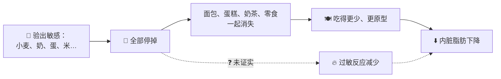

# Genten Daily｜能不能用"过敏"切入"身体发炎"？

> [!abstract] 一句话建议
> **"身体发炎"这个赛道可以进，但不要用"过敏检测 → 停掉敏感源 → 内脏脂肪下来"当主线。**
> 用 **"内脏脂肪会发炎、会变坏"** 当核心，把"食物"当成**其中一条线索**，而不是答案。

---

## 🚦 快速判断

| 元素 | 用不用？ | 为什么 |
|---|---|---|
| 🎯 洞察："很努力，内脏脂肪还是下不来" | ✅ 用 | 真实痛点，也给消费者"不是你不够自律"的出口 |
| 🔥 "身体发炎"这个语言 | ✅ 用 | 消费者听得懂；"内脏脂肪 ↔ 炎症"有人体研究支持 |
| 🍞 "食物会影响发炎" | 🟡 小心用 | 老鼠实验有机制；人体未证实。只能讲"可能是线索之一" |
| 🧪 IgG 敏感源检测当入口 | 🔴 不用 | 主流过敏学会不承认；双盲试吃 45 人 0 人有反应 |
| 🚫 "发炎时不能运动" | 🔴 不用 | 和主流研究方向相反，运动是减内脏脂肪最稳的方法之一 |
| 💬 "停掉发炎比打 Botox 好" | 🔴 不用 | 夸大，容易被专业人士打脸 |

---

## 🔍 逐条拆解：医生的故事哪里站得住？

### 1. "停掉敏感源，一个月内脏脂肪直接下来"
**效果可能是真的，但原因很可能不是"过敏"。**



- IgG 最常"阳性"的食物，正好是**最常吃**的：小麦、奶、蛋（沙特儿童研究：奶 88%、麸质 81%、蛋 67%）
- 停掉它们 ≈ 自动少吃很多精制淀粉和加工食品 → 热量下降
- 你资料里的唯一个案（Andjelković 2024），同时也改了饮食、加了运动、用了药，**无法分出是哪一个起作用**
- 20+ 客户"复制成功"：没有对照组，不知道同样少吃但不验血的人会不会一样

### 2. "指数超过 20 轻微敏感，到红线一吃就痒"
- **"一吃就痒"是 IgE 型过敏**（快速反应），IgG 检测测不出这个
- 两种抗体被混在一起讲了

### 3. "对小分子淀粉敏感，不能吃白米，可以吃红米"
- 抗体一般针对的是**蛋白质**，淀粉是碳水化合物
- 白米和红米的蛋白质基本一样
- 换成红米有好处，比较可能的原因是：**纤维多、升糖慢**，不是"不敏感"

### 4. 小红书"28 天"框架
| 周 | 内容 | 评价 |
|---|---|---|
| 1 | 去掉敏感源 | 🟡 等于"减少加工食品"，有效但原因不同 |
| 2 | 只吃蔬菜 | 🔴 蛋白质太低，掉的可能有肌肉 |
| 3 | 加蛋白质 | ✅ 合理 |
| 4 | 转换身体状态 | ⚪ 太模糊 |
| 全程 | 不运动 | 🔴 方向错误 |
| 全程 | 睡 7–8 小时 | ✅ 合理；压力荷尔蒙和腰围增加有关（👥 1,604 人追踪） |

---

## 🧭 三个定位选项

| | A. 过敏检测切入 | B. "脂肪变坏"切入 ⭐ | C. 混合 |
|---|---|---|---|
| 核心讲法 | 找出让你发炎的食物 | 内脏脂肪不只是多，是会发炎、会变坏 | 发炎有多个来源，食物是其中一条线索 |
| 科学基础 | 🔴 | 🟢 人体 + 🐭 机制 | 🟡 |
| 和 30+ 博主的差异 | ❌ 一模一样 | ✅ 讲他们没讲的"为什么" | 🟡 |
| 被医生／过敏科打脸风险 | 高 | 低 | 中 |
| 广告合规风险 | 高（检测、诊断、疾病字眼） | 中（要避开疗效宣称） | 中 |
| 消费者吸引力 | 高（有"答案"） | 中高（有"原因"） | 高 |

> [!tip] 建议：B 做主线，C 做内容延伸
> - **主线 B**：*"你的内脏脂肪不是懒，是在发炎。"* 讲脂肪巴士、脂肪变坏、循环可以反转
> - **延伸 C**：食物、睡眠、压力都是"火种"；教消费者**记录**，而不是买检测
> - **差异化**：市场上 30+ 博主都在讲"忌口 28 天"，GE 可以当那个**讲清楚原理、不吓人**的品牌

---

## 🔥 更新：切入点换成"低度发炎"，不是"过敏"

```
🚨 过敏          😣 不耐受         🤷 敏感           🔥 低度发炎
一吃就痒/肿      消化不了          说不清的不舒服     没感觉，但身体
（有检测）       （如乳糖）         （没有标准定义）    指标偏高
    ← 清楚、有诊断 ─────────────────── 模糊、靠推论 →
```

- 医生案例的"内脏脂肪下不来、身体卡住"更像**低度发炎**：没症状，但身体一直"小火慢烧"
- 🐭 老鼠实验正好是这个样子：没痒、体重没变，但腹部脂肪在发炎、血糖变差
- 👥 人体：一餐高脂饮食后，血液中的细菌碎片增加（Erridge 2007，经 Wang 2010 引用）
- 证据多指向 **"吃法会点火"**（高脂、加工、吃太多），而不是 **"你个人敏感某种食物"**

| 说法 | 建议 |
|---|---|
| "你的身体可能在低度发炎" | ✅ |
| "吃的方式会点火" | ✅ |
| "每个人的'火种'可能不一样，从记录开始" | 🟡 讲成可能 |
| "验血找出让你发炎的食物" | 🔴 |

> [!tip] 如果要"证明"
> 追踪 **hs-CRP**（高敏 C 反应蛋白，一般体检就能验）的前后变化，比只看体脂秤的内脏脂肪等级更有说服力。

---

## ⚠️ 合规提醒（需和法规同事确认）
- 食品／保健品广告一般**不能**宣称治疗、预防疾病，也不能宣称"消炎""减内脏脂肪"这类疗效
- "发炎"一词接近疾病用语，要看当地规定能不能用在产品文案里
- 教育内容（品牌科普）和产品宣称要**分开**处理

---

## ❓ 待确认
- [ ] GE 目前卖的是什么产品？定位会跟着产品调整
- [ ] 目标市场与法规（马来西亚？）
- [ ] 老板能否接受"不用检测当入口"？
