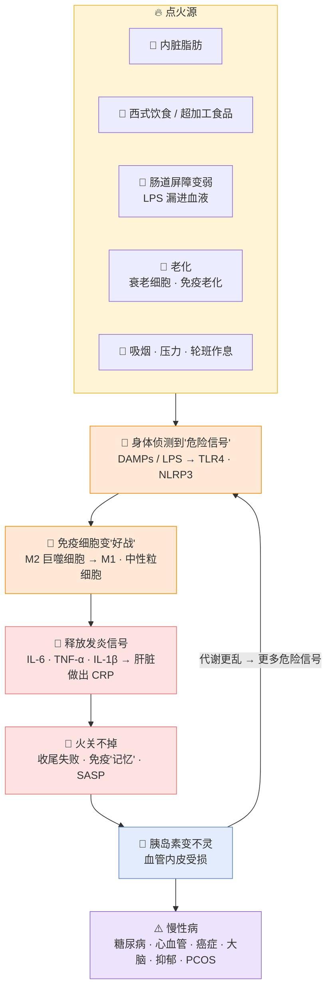
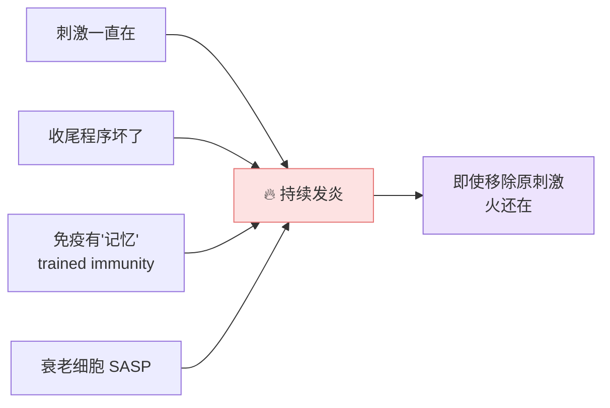
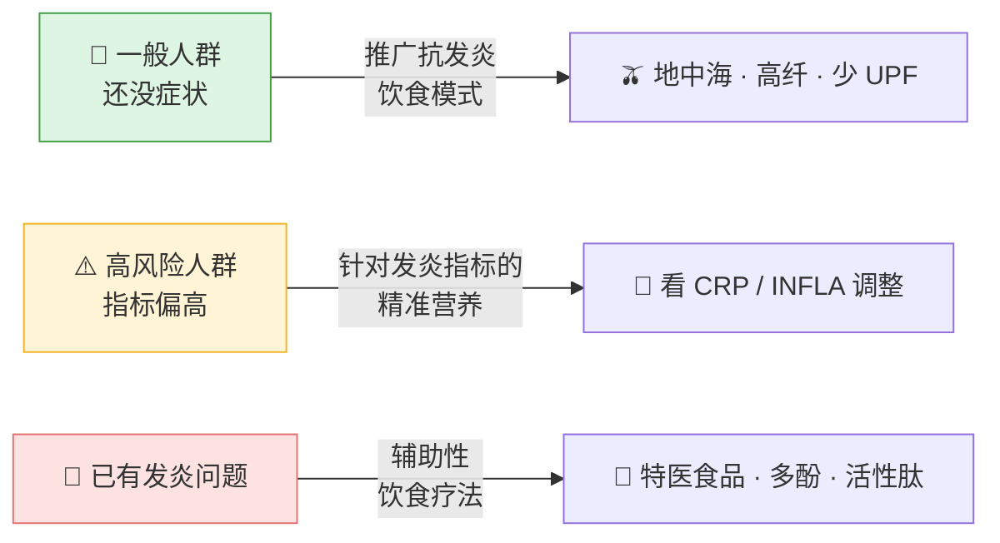

# 🔥 慢性低度炎症（Chronic Low-Grade Inflammation）

> [!abstract] 一句话讲完
> **身体里有一把"小火"一直没熄。** 它不痛、不发烧、没感觉，但长期烧着，会慢慢伤到血管、血糖控制、大脑和其他器官。
> 点火的主要是 **内脏脂肪、不健康饮食、肠道漏进来的细菌碎片、老化**；
> 现有研究显示，这把火越旺，**死亡风险、心血管代谢病、代谢综合征、大脑萎缩、抑郁** 都更常见。
> 饮食（尤其是地中海饮食、多酚、纤维）是目前被研究最多的"降火"方法。

> [!info] 这份笔记怎么读
> 1️⃣ 先看「急性 vs 低度」→ 2️⃣ 看机制大图 → 3️⃣ 看 6 个点火源 → 4️⃣ 看「为什么关不掉」→ 5️⃣ 看现有证据（后果 + 饮食）
> 证据等级不在这里评，只列：**研究做了什么、多少人、看到什么**。

---

## 1️⃣ 先分清楚：急性发炎 vs 低度慢性发炎

| | 🚑 急性发炎 | 🕯️ 慢性低度炎症 |
|---|---|---|
| 像什么 | 消防队出动，灭完就收队 | 一根没熄的蜡烛，一直慢慢烧 |
| 触发 | 细菌、伤口 | 脂肪、饮食、肠道、老化等**持续存在的刺激** |
| 感觉 | 红、肿、热、痛 | **没感觉**（subclinical） |
| 血液指标 | CRP 可以飙到几十、上百 | CRP 只是**略高**，常在 1–10 mg/L |
| 结局 | 修复完成，回到正常 | 慢慢损伤组织，和多种慢性病相关 |

> [!quote] 论文里的定义
> 「一种持续、低程度、无症状的全身免疫反应，由**体内自己的危险信号**触发，特点是**炎症没有被收尾（unresolved）**。」
> — Wang et al. 2026, *Trends Endocrinol Metab*

**常见的叫法**（指的是同一类东西，看到不要混乱）：
- **Metainflammation / 代谢性炎症**：强调由肥胖、代谢问题引起
- **Inflammaging / 炎性衰老**：强调随年龄出现
- **CLIP**（Chronic Low-grade Inflammatory Phenotype）：老年医学用语，IL-6、CRP 比年轻人高 **2–4 倍**
- **Parainflammation / "cold" inflammation**：其他文献的说法

---

## 2️⃣ 机制大图：一把火怎么点起来、怎么烧下去

> [!tip] 白话版逻辑
> 1. **有东西一直在刺激身体**（脂肪太多、吃得不好、肠道漏、老化）
> 2. **身体的"警报器"**（TLR4、NLRP3 这些受体）把它当成敌人
> 3. **免疫细胞从"维修工"变成"战士"**（M2 → M1 巨噬细胞）
> 4. **战士一直喊"有敌人！"**（IL-6、TNF-α），肝脏跟着做出 **CRP**
> 5. 正常应该打完就收队，但**收不了尾**
> 6. 发炎信号干扰胰岛素 → 血糖、血脂更乱 → 又产生更多危险信号 → **恶性循环**
>
> 📌 León-Pedroza 2015：「一旦建立，就形成恶性循环……打破它需要**同时**控制代谢和发炎两边。」

---

## 3️⃣ 六个主要点火源

### 🫃 ① 内脏脂肪（被研究最多的源头）

- **脂肪不只是仓库，是一个会分泌激素的器官**：分泌 IL-1、IL-6、IL-8、TNF-α、leptin、resistin（Castro 2017）
- 瘦的人的脂肪：多分泌**抗发炎**信号；肥胖的人：多分泌**促发炎**信号（Khanna 2022）
- **内脏脂肪（VAT）比皮下脂肪（SAT）更关键**：代谢问题主要跟 VAT 增加有关（Pereira 2014）
- 巨噬细胞在脂肪里的数量**跟 BMI 成正比**（Sanada 2018）
- 🔁 **也有"刹车"**：Treg、ILC2、IL-10 会对抗发炎 → 解释了为什么有些人胖但代谢还算健康（metabolically healthy obesity）（Pereira 2014）

### 🍔 ② 饮食

| 促发炎 🔺 | 机制白话 | 来源 |
|---|---|---|
| 饱和脂肪过多 | 被氧化成"危险信号"（oxPLs），激活 NLRP3、TLR4 | Wang 2026 |
| 高糖 / 高 GI | 糖 + 蛋白 → **AGEs（糖化终产物）**→ RAGE → 血管发炎 | Wang 2026 · Rudnicka 2021 |
| 高盐 | 破坏肠道通透性和菌群 | Wang 2026 |
| 超加工食品（UPF） | 高糖高脂高钠 + **乳化剂、甜味剂**等添加物 + 纤维与微量营养素不足 | Tristan Asensi 2023 |
| 红肉、贝类（部分情况） | 胆碱、肉碱 → 肠菌 → TMAO（促发炎） | Wang 2026 |

| 抗发炎 🔻 | 机制白话 | 来源 |
|---|---|---|
| 膳食纤维 / 抗性淀粉 | 喂好菌 → 产生**短链脂肪酸 SCFA** → 加强肠壁 | Wang 2026 |
| 多酚（蔬果、茶、咖啡、黑巧、橄榄油） | 抗氧化、阻断 NF-κB 等发炎开关、调节基因表达 | Bonaccio 2016 |
| Omega-3、MUFA | 减少促发炎介质的原料 | Polak-Szczybyło 2023 |
| 镁、维生素 C/D、锌、烟酸 | UPF 吃多容易缺，这些被视为抗发炎营养素 | Tristan Asensi 2023 |

### 🦠 ③ 肠道：细菌碎片"漏"进血液

- **LPS**（革兰氏阴性菌外膜成分）是很强的发炎刺激物
- 肠道屏障变弱 → LPS 进入血液 → 叫 **代谢性内毒素血症（metabolic endotoxemia）** → 发炎 + 胰岛素阻抗（Pereira 2014 · Minihane 2015）
- 老人肠道：**双歧杆菌、F. prausnitzii 等抗发炎菌变少**，链球菌、肠杆菌等变多；双歧杆菌数量跟 TNF-α、IL-1β **反向相关**（Sanada 2018）
- 婴幼儿菌群可塑性比成人高 → 早期饮食影响菌群定型（Wang 2026）

### 👴 ④ 老化（Inflammaging）

| 来源 | 白话 |
|---|---|
| **衰老细胞 SASP** | 不分裂但不肯死的"僵尸细胞"，不停分泌发炎物质；动物实验中清除它们可减缓动脉硬化、骨关节炎 |
| **免疫老化** | 先天免疫"调不准"，一直处于低度警戒 |
| **细胞垃圾堆积** | 线粒体 DNA 碎片、异常抗体（IgG-G0）没清掉 → 被当成危险信号 |
| **凝血因子升高** | 凝血因子 Xa 也会通过 PAR 受体推动发炎和细胞衰老 |
| **慢性病毒感染** | 尤其是巨细胞病毒（CMV）（Chen 2019） |

（Sanada 2018 · Chen 2019）

### 🚬 ⑤ 生活方式与作息
- 吸烟：香烟中的活性氧 → IL-6、TNF-α、IL-1β 上升（Sanada 2018）
- 心理压力、牙周病也被列为点火源（Sanada 2018）
- 轮班工作者：发炎分数越高，代谢综合征越多（Jiang 2025）
- 运动不足、腰臀比高 → INFLA 分数越高（Bonaccio 2016）

### 🧬 ⑥ 激素：PCOS 例子
- PCOS 女性对比**同年龄、同 BMI** 的女性，CRP、IL-18、TNF-α、IL-6、白细胞、MCP-1 都更高；AGEs 和 RAGE 也更高
- 肥胖、高胰岛素、高雄激素 **互相加重** 发炎（Rudnicka 2021）

---

## 4️⃣ 为什么这把火"关不掉"？

> [!important] 关键概念：问题不只是"有火"，而是"灭不掉"
> 急性发炎有**两个阶段**：先打仗，再收尾修复。低度慢性炎症的核心是 **收尾（resolution）失败**。

- **刺激源没移除**（脂肪、饮食还在）→ 一直点火
- **免疫"记忆"**：先天免疫细胞被高糖、高脂"训练"过后，会产生表观遗传改变，之后更容易过度反应 → 作者建议**在肥胖、糖尿病前期就介入**（van de Vyver 2023）
- **刺激移除了，火还在**：降了 LDL、停了烟，低度炎症仍可能持续 → 用 SASP 和免疫印记解释（Sanada 2018）
- **屏障被破坏**：血脑屏障、血视网膜屏障等在长期发炎和氧化压力下被破坏 → 发炎扩散到神经、视网膜、血管（Rönnbäck 2019）
- **"火上加火"**：本身有低度炎症（如肥胖）的人，遇到重症或败血症时，发炎反应更猛、预后更差（Balderas-Peña 2023）

---

## 5️⃣ 怎么"看见"这把火？

| 指标 | 意思 | 常用切点 / 用法 |
|---|---|---|
| **hs-CRP** | 肝脏做的发炎蛋白，最常用 | **>3 mg/L** = 低度炎症；**>1 mg/L** = 偏高；≥10 多被当急性发炎排除 |
| **IL-6 / TNF-α** | 发炎信号本身 | 研究常用，临床较少 |
| **白细胞 WBC** | 免疫细胞数量 | 常规血检就有 |
| **血小板 PLT** | 也参与发炎 | 常规血检就有 |
| **粒细胞/淋巴细胞比（G/L）或 NLR** | 早期细胞发炎反应 | 常规血检可算 |

> [!example] INFLA-score：一个"发炎总分"
> 把 **CRP + 白细胞 + 血小板 + G/L 比** 四项，各自按十分位打分（−4 到 +4），加起来 **−16 到 +16**。
> 分数越高 = 低度炎症越重。好处：**用常规血检就能算**，而且四项一起看比单看一项更全面。
> 由意大利 Moli-sani 研究团队提出，后来 UK Biobank 和中国研究都在用。

---

## 6️⃣ 现有证据 A｜低度炎症跟哪些后果有关？

| 后果 | 研究 | 人数 / 设计 | 看到什么 |
|---|---|---|---|
| 💀 **全因死亡** | Bonaccio 2016 · Moli-sani（意大利） | 20,337 人，追踪中位 7.6 年 | INFLA 最高 1/4 vs 最低：死亡风险 **+44%**（HR 1.44）；糖尿病患者 **HR 2.90**，有心血管病史 **HR 2.48**；风险大小跟癌症、糖尿病相当 |
| ❤️ **心血管代谢多病共存** | Cheng 2024 · UK Biobank | 273,804 人，40–69 岁，中位 ~13.9 年 | 最高 1/4 风险 **+36%**；**发病提早约 13 个月**；分数 ≥9 后每加 1 分风险 +5.9%（<9 时 +1.9%） |
| 🩸 **代谢综合征** | Jiang 2025 · 新疆油田轮班工人 | 1,758 人，横断面 | 最高 1/4 vs 最低：**3.58 倍**；与血糖、血压、腰围、TG 升高、HDL 下降都相关；女性关联更强 |
| 🧠 **大脑结构** | Bao 2024 · UK Biobank | 37,699 人 | 发炎越高，**皮质和皮质下体积越小**（苍白球、丘脑、脑岛等）；男性、身体衰弱者、城市居民更明显 |
| 😔 **抑郁** | Osimo 2019 · Meta 分析 | 37 项研究，13,541 名患者 | **约 27%** 抑郁患者 CRP >3；**58%** CRP >1；对比健康对照 OR 1.46 |
| 🧓 **衰弱 frailty** | Chen 2019 · 综述 | — | CLIP 被视为衰弱和多种老年慢病的重要推手 |
| 🧠 **失智** | Wang 2026 引用一项 22.3 年追踪 | — | 饮食发炎指数高 → 失智 **+84%**、阿尔茨海默 **+88%** |
| ♀️ **PCOS** | Rudnicka 2021 · 综述 | — | 发炎指标高于同龄同 BMI 女性 |
| 🧒 **儿童肥胖** | Polak-Szczybyło 2023 · 综述 | — | 胰岛素阻抗、脂肪肝等并发症都和低度炎症有关；儿童研究仍少 |
| 🏥 **重症预后** | Balderas-Peña 2023 · 书章 | — | 肥胖带来的低度炎症，让重症时全身发炎反应更剧烈、预后更差 |

---

## 7️⃣ 现有证据 B｜饮食能不能"降火"？

### 🫒 地中海饮食 / 多酚

| 研究 | 看到什么 |
|---|---|
| Meta 分析（17 项临床试验）· 引自 Tristan Asensi 2023 | 越贴近地中海饮食，**CRP、IL-6 越低**；在多种饮食模式比较中降幅最明显 |
| PREDIMED 12 个月 · 引自 Bonaccio 2016 | 地中海饮食组 CRP、IL-6 下降多于低脂饮食组 |
| Richard 2013 · 引自 Bonaccio 2016 | 代谢综合征男性：**没减重**也能降发炎；有减腰围效果更大 |
| Moli-sani · Bonaccio 2014/2016 | 地中海饮食得分越高，**血小板和白细胞越低**，部分由抗氧化物和纤维解释 |
| Moli-sani · 多酚 PAC 分数 | PAC 每 +10 分，处于高发炎状态的机会 **−5% 到 −8%**；多酚可解释女性 16.7%、男性 9.1% 的发炎分数差异 |
| Moli-sani · 黑巧克力 | **约每 3 天 1 份（~20g）** 的人 CRP 最低；不吃或吃太多都较高（J 形） |
| 柳橙汁 + 高脂餐 · 引自 Bonaccio 2016 | 一起喝可**减弱餐后发炎反应** |

### 🍟 超加工食品（UPF）

| 研究 | 看到什么 |
|---|---|
| 澳洲 Melbourne 队列 · 引自 Tristan Asensi 2023 | UPF 每多 **100g/天**，hs-CRP **+4%**，与 BMI 无关 |
| 巴西青少年 391 人 | UPF 最高 1/3：CRP、leptin 更高，**IL-8 +79%** |
| Moli-sani | UPF 吃越多，饮食的促发炎潜力越高 |
| 乳化剂 / 甜味剂 | 动物和细胞实验提示可能经菌群促发炎；人体数据还不一致 |

### 🌾 纤维、肠菌与其他

| 研究 | 看到什么 |
|---|---|
| 抗性淀粉 · 引自 Wang 2026 | 增加双歧杆菌等 → 腹部脂肪和全身发炎降低（TLR4/NF-κB 被抑制、肠壁蛋白增加） |
| 发酵食品 · 引自 Wang 2026 | 提高菌群多样性、减少发炎介质 |
| 芝麻提取物（脂肪酶抑制）· 双盲 | 高脂餐后血中 TG 增幅 **−16.8%** |
| 高 GI / 高 GL 饮食 · 前瞻队列 | 糖尿病风险 **+15% / +21%**，BMI 高的人更明显 |
| 西式饮食青少年 · 引自 Polak-Szczybyło 2023 | CRP、IL-6 较高 |
| Omega-3 · ILSI（Minihane 2015） | 动物 / 细胞实验效果明显；**人体空腹发炎指标的结果不一致**，餐后状态的影响较清楚 |

> [!note] ILSI Europe 共识（Minihane 2015）的提醒
> 现有人体数据大多靠测**空腹时血液**里的发炎指标，而这些指标对组织里的发炎**不够敏感、波动很大**。
> 作者建议用"挑战测试"（例如吃一餐高脂餐后看反应）来看身体的发炎**弹性**。

---

## 8️⃣ 2026 最新思路：分三层"早期营养介入"

> [!quote] Wang et al. 2026 的核心主张
> 「无症状的慢性低度炎症，是饮食介入的**关键窗口期**。」
> 要的是**长期、持续**的饮食策略，而不是短期介入。

营养影响发炎的 **5 个层次**（同一篇）：
1. **消化吸收**：少吸收坏的（饱和脂肪）、多吸收好的（维生素）
2. **肠道菌群**：纤维、多糖、多酚 → 好菌 → SCFA
3. **体内化学反应**：抗氧化、减少糖化（AGEs）
4. **信号通路**：NF-κB、TLR4、NLRP3
5. **细胞组成**：膜脂肪酸组成等

---

## 9️⃣ 给团队：可以怎么讲（白话素材）

> [!success] 讲得通的句子
> - 「身体里有一把**看不见的小火**，不痛不痒，但一直在烧。」
> - 「脂肪不只是储存，**内脏脂肪会自己'喊发炎'**。」
> - 「问题不是发炎，而是**发炎收不了尾**。」
> - 「一般血检里的 CRP、白细胞、血小板，就能拼出一个**发炎分数**。」
> - 「在 2 万多人的研究里，发炎分数最高的一群，死亡风险高了 44%。」
> - 「27 万人的数据：发炎越高，心血管代谢病**来得越早**。」
> - 「地中海饮食在**没有减重**的情况下，也能降低发炎指标。」

> [!warning] 讲的时候注意
> - 人群研究多数是"**有关联**"，不是"证明造成"——用"和……有关 / 更常见"比"导致"安全
> - 动物和细胞实验的结果（乳化剂、Omega-3 机制等）别直接讲成人体效果
> - CRP 只是其中一个指标，单次检测会波动
> - 具体食物 / 成分功效宣称要看当地法规

---

## 📚 资料清单（21 篇）

| # | 年份 | 题目（简） | 类型 | 主要用在 |
|---|---|---|---|---|
| 1 | 2014 | Low-Grade Inflammation, Obesity, and Diabetes（Pereira） | 综述 | 脂肪 · 肠道 LPS |
| 2 | 2015 | Low-grade systemic inflammation & metabolic diseases（León-Pedroza） | 综述 | 恶性循环 |
| 3 | 2015 | Low-grade inflammation, diet composition and health（Minihane · ILSI） | 共识综述 | 饮食证据 · 测量局限 |
| 4 | 2016 | Mediterranean diet, polyphenols & LGI（Bonaccio · Moli-sani） | 综述 | 地中海 · 多酚 · 黑巧 |
| 5 | 2016 | A score of LGI and mortality（Bonaccio · Moli-sani） | 队列 | INFLA · 死亡 |
| 6 | 2017 | LGI, obesity & chronic degenerative diseases（Castro） | 综述 | 脂肪激素 |
| 7 | 2018 | Source of Chronic Inflammation in Aging（Sanada） | 综述 | 炎性衰老来源 |
| 8 | 2019 | CLIP and Senescent Immune Dysregulation（Chen） | 综述 | CLIP · 衰弱 |
| 9 | 2019 | LGI in depression: CRP meta-analysis（Osimo） | Meta 分析 | 抑郁 |
| 10 | 2019 | LGI due to damage of cellular barrier systems（Rönnbäck） | 综述 | 屏障破坏 |
| 11 | 2021 | Chronic LGI in pathogenesis of PCOS（Rudnicka） | 综述 | PCOS |
| 12 | 2022 | Obesity: A Chronic LGI and Its Markers（Khanna） | 综述 | 脂肪 · 激素 |
| 13 | 2023 | Immunology of chronic LGI & metabolic function（van de Vyver） | 综述 | 免疫记忆 · 收尾失败 |
| 14 | 2023 | LGI and Ultra-Processed Foods（Tristan Asensi） | 综述 | UPF |
| 15 | 2023 | LGI & Anti-Inflammatory Diet in Childhood Obesity（Polak-Szczybyło） | 综述 | 儿童 |
| 16 | 2023 | Influence of chronic LGI on systemic inflammatory response（Balderas-Peña） | 书章 | 重症预后 |
| 17 | 2024 | Low-grade Chronic Inflammation: Shared Mechanism（Cifuentes） | 综述 | 慢病共同机制 |
| 18 | 2024 | Chronic LGI & cardiometabolic multimorbidity（Cheng · UK Biobank） | 队列 | 多病共存 |
| 19 | 2024 | Chronic LGI & brain structure（Bao · UK Biobank） | 队列 | 大脑 |
| 20 | 2025 | INFLA-score & metabolic syndrome in shift workers（Jiang） | 横断面 | 代谢综合征 |
| 21 | 2026 | Early nutritional interventions for chronic LGI（Wang） | 综述 | 三层介入 |

📁 原文：[Google Drive 文件夹](https://drive.google.com/drive/folders/19JwMdVpIegRcXA3oSSuR8tHlC15cVbyj)

> [!info] 相关笔记
> [[04_低度炎症｜分子机制详解]]（technical 版） · [[00_故事架构]] · [[01_GE定位｜过敏切入评估]] · [[02_旁白脚本与分镜]]
