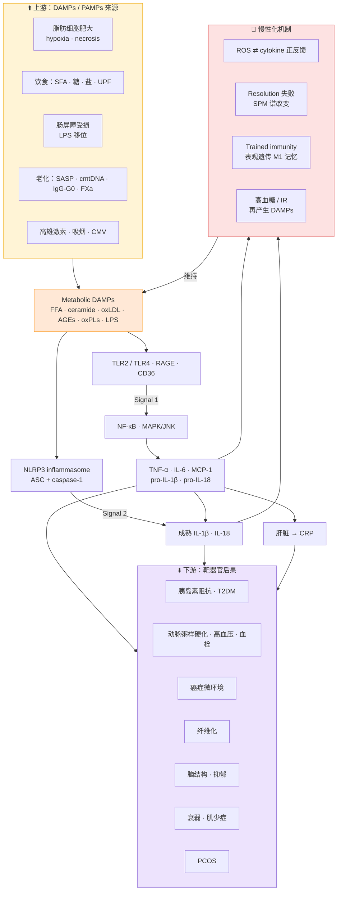
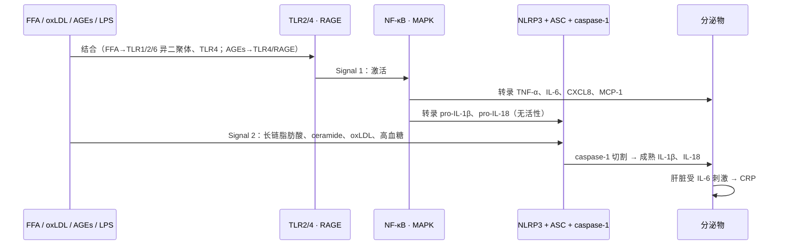
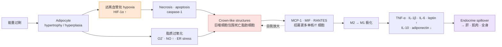
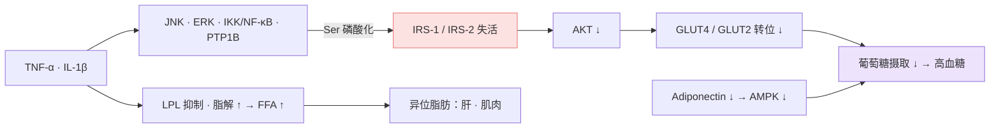
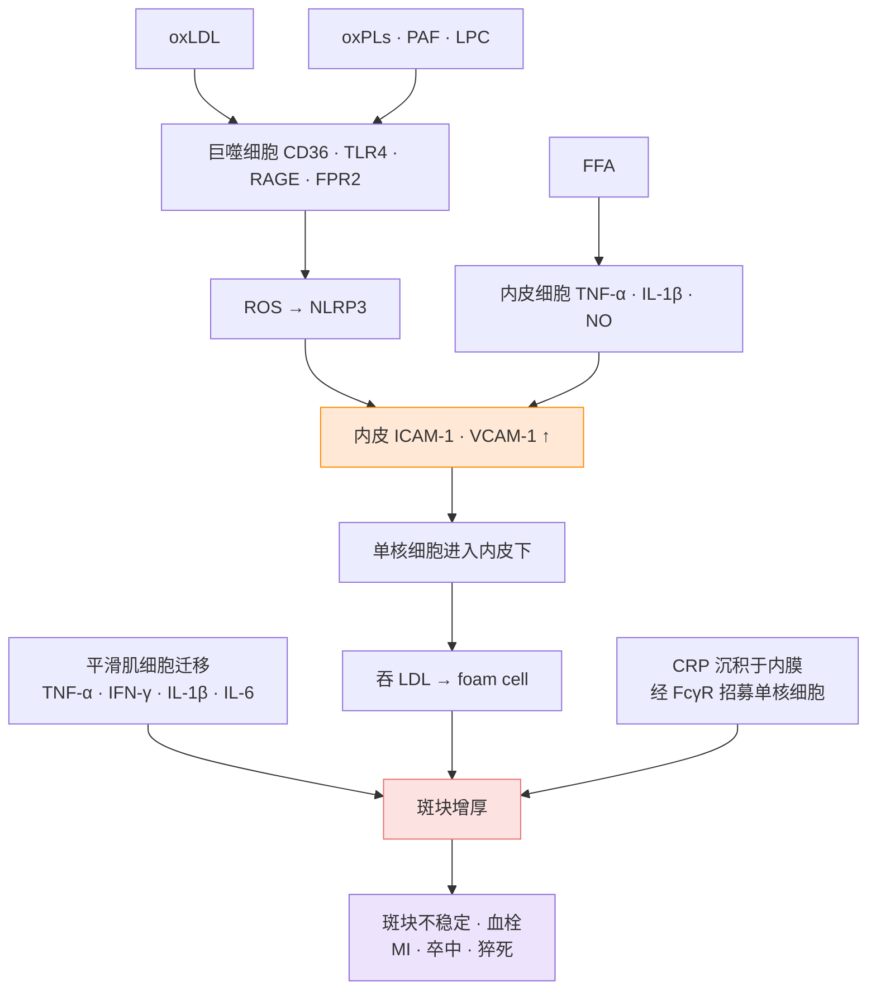

# 🧬 慢性低度炎症：分子机制详解

> [!abstract] 核心框架（三段式）
> **上游（Inputs）**：代谢过剩、饮食、肠道 LPS、老化、激素 → 产生 **metabolic DAMPs / PAMPs**
> **中游（Engine）**：PRRs（TLR2/4、RAGE、NLRP3）→ NF-κB / JNK → TNF-α、IL-1β、IL-6 → CRP；同时**消退（resolution）失败** + **先天免疫表观记忆** + **ROS–cytokine 正反馈** → 变成慢性
> **下游（Outputs）**：同一组细胞因子作用在不同组织 → 胰岛素阻抗、β 细胞凋亡、动脉粥样硬化、高血压、肿瘤微环境、纤维化、神经结构改变、衰弱
>
> 关键概念：低度炎症是多种慢病的 **"common soil"**（共同土壤）—— 不同疾病共享同一条上游机制。（Bonaccio 2016 · Cifuentes 2024）

> [!info] 阅读说明
> 每一段都注明来源论文。白话版见 [[03_低度炎症｜机制与证据整理]]。证据等级不在本文评定。

---

## 0️⃣ 定义：Low-grade systemic inflammation（LGSI）≠ classical inflammation

León-Pedroza 2015（Table 1）的对照：

| | Classical inflammation | Low-grade systemic inflammation |
|---|---|---|
| 时程 | Acute / subacute | **Chronic** |
| 部位 | Local | **Systemic，集中在 insulin-dependent tissue**（脂肪、肝、肌肉） |
| 浸润细胞 | Neutrophils、eosinophils、NK、T 细胞、巨噬细胞 | **巨噬细胞、T 细胞**（几乎没有中性粒细胞） |
| 介质 | TNF-α、IL-1β、IL-6、ROS | TNF-α、IL-6、**CRP**、ROS |
| 激活物 | PAMP + DAMP | **Metabolic DAMP** |
| 组织损伤 | 有 | **没有明显结构损伤或功能丧失**（这是"low-grade"的定义特征） |
| 相关疾病 | 结肠炎、腹膜炎、SIRS | 血脂异常、动脉粥样硬化、T2DM、高血压 |

**Metabolic DAMPs**（代谢性危险信号）：FFA（尤其 palmitate）、ceramides、oxLDL、AGEs、oxidized phospholipids、cell-free mitochondrial DNA、IgG-G0。它们引发的是**强度较低但持续较久**的反应（León-Pedroza 2015）。

---

## 1️⃣ 总机制图

---

## 2️⃣ 中游引擎：PRR → 转录 → 细胞因子（两信号模型）

- **TLR 识别**：FFA 结合 TLR2 和 TLR4；ceramides 和 oxLDL 激活 TLR4。下游 **NF-κB 与 MAPK** 一方面转录 TNF、IL-6、pro-IL-1β、pro-IL-18，另一方面**直接通过 IRS-1 丝氨酸磷酸化抑制胰岛素信号**（Pereira 2014）
- **TLR4 在代谢疾病中表达上调**；高血糖时血红蛋白、白蛋白、LDL 的 lysine/arginine 残基发生非酶糖基化 → AGEs → 结合巨噬细胞 TLR4（León-Pedroza 2015）
- **NLRP3**：被长链脂肪酸、ceramides、oxLDL、高血糖激活 → 与 ASC、caspase-1 组装 → 切割 pro-IL-1β / pro-IL-18（Pereira 2014）
- **AGE–RAGE → NF-κB** 放大炎症；RAGE 表达于 T 细胞、单核细胞、巨噬细胞（van de Vyver 2023）
- **细胞因子信号**：通过 JAK–STAT 与 NF-κB 通路做旁分泌放大（van de Vyver 2023）

---

## 3️⃣ 上游：各触发源如何汇入低度炎症

### 3.1 内脏脂肪组织（LGSI 的起点）

| 步骤 | 机制 | 来源 |
|---|---|---|
| Hypoxia | 肥大的脂肪细胞离血管远 → 缺氧 → 坏死；HIF-1α 直接调控 leptin、VEGF，并驱动巨噬细胞累积 | León-Pedroza 2015 · Pereira 2014 |
| Oxidative / ER stress | 大量脂肪酸 → 脂质过氧化 → ROS/RNS 爆发；蛋白折叠错误 → ER stress、autophagy、apoptosis | León-Pedroza 2015 |
| Crown-like structures | 巨噬细胞包围死亡脂肪细胞，是脂肪组织低度炎症的**组织学标志**；浸润细胞本身成为细胞因子的持续来源 | León-Pedroza 2015 |
| 趋化因子 | MCP-1、MIF、RANTES 招募更多巨噬细胞和淋巴细胞 → 免疫浸润自我维持 | León-Pedroza 2015 |
| 巨噬细胞极化 | M2（抗炎）→ M1（促炎），与胰岛素阻抗相关 | Khanna 2022 · Pereira 2014 |
| Adipokine 失衡 | leptin、resistin、visfatin ↑；adiponectin ↓（adiponectin 经 AdipoR1/R2 → **AMPK**，在肝脏提高胰岛素敏感性、减少葡萄糖输出） | Pereira 2014 · Khanna 2022 |
| VAT > SAT | 代谢异常主要与 VAT 扩张相关，与 SAT 关系较弱（MRI 研究） | Pereira 2014 |
| 对抗机制 | ILC2、Treg、IL-10 对抗炎症 → 解释 metabolically healthy obesity | Pereira 2014 |

### 3.2 饮食 → DAMPs

| 饮食成分 | 分子路径 | 来源 |
|---|---|---|
| **饱和脂肪** | β-oxidation ↑ → 线粒体 ROS → 中性脂质过氧化成 **oxPLs**（DAMP）→ NLRP3 + TLR4；形成自我维持的炎症环路。循环 oxPLs 与内脏脂肪指数相关 | Wang 2026 |
| Palmitate（SFA） | 直接结合巨噬细胞 TLR1/2/6 → 细胞因子释放 | León-Pedroza 2015 |
| **糖 / 高 GI** | Fructose–glucose 协同 → **polyol–AGE/RAGE 轴** → 胰岛素阻抗 + 血管炎症 | Wang 2026 |
| 高盐 | 破坏肠通透性与菌群 | Wang 2026 |
| **UPF** | 营养层面：高糖、SFA、trans fat、钠，低纤维、Mg、维生素 C/D、Zn、烟酸；非营养层面：乳化剂、甜味剂、加工/包装化学物，可能经菌群促炎（动物/体外数据）；加工也改变食物结构 → 更高 GL、更弱的 gut–brain 饱足信号 | Tristan Asensi 2023 |
| 胆碱 / 肉碱（红肉、贝类） | 肠菌 → TMA → 肝脏转化为 **TMAO**（促炎）；但肉蛋白也产生 branched-chain SCFA（抗炎）→ 同一食物有双向作用 | Wang 2026 |
| Linoleic acid → ARA | → COX/LOX → PGE2、LTB4 等促炎脂质介质 | Wang 2026（Fig. 2） |

**保护性成分的分子靶点：**

| 成分 | 机制 | 来源 |
|---|---|---|
| 膳食纤维 / 抗性淀粉 | Lactobacillus、Bifidobacterium ↑ → **SCFA** → GPCR 信号强化黏膜屏障、降 pH 抑制病原菌；抗性淀粉 → *B. adolescentis*、*R. bromii* ↑ → **TLR4/NF-κB 抑制 + tight-junction 蛋白上调** | Wang 2026 |
| 多糖（如石斛多糖） | → *Parabacteroides distasonis* → nicotinic acid → **GPR109a** → 屏障与胰岛素敏感性改善 | Wang 2026 |
| 多酚 | (a) 抗氧化 / 上调抗氧化基因；(b) 减轻 ER stress；(c) 阻断促炎细胞因子与 endotoxin 介导的 kinases 和转录因子；(d) 通过 HDAC 活性抑制炎症基因表达；(e) 激活拮抗慢性炎症的转录因子 | Bonaccio 2016 |
| 抗氧化物 | 淬灭 ROS、激活内源防御（SOD、GSH-Px） | Wang 2026 |

### 3.3 肠道：Metabolic endotoxemia

- 高脂饮食降低 tight-junction 蛋白表达、改变菌群 → **metabolic endotoxemia** → 炎症张力 ↑、体重 ↑、胰岛素阻抗（Pereira 2014）
- **人体低剂量 LPS 注射**：可诱导细胞因子释放、脂肪组织低度炎症和胰岛素阻抗（Pereira 2014）
- 抗生素降低血 LPS → 糖耐量、体重增加、炎症标志、VAT 巨噬细胞浸润都下降（动物）；把高脂饮食小鼠的菌群移植给无菌小鼠，脂肪沉积多于瘦供体（Pereira 2014）
- 老年人：LPS 产生菌多、双歧杆菌少（Minihane 2015）；双歧杆菌丰度与 TNF-α、IL-1β 负相关（Sanada 2018）

### 3.4 老化（Inflammaging / CLIP）

| 来源 | 分子机制 | 来源 |
|---|---|---|
| **Cellular senescence / SASP** | 端粒缩短、基因毒性压力、细胞因子 → p53 / p16 激活 → 不可逆细胞周期停滞 → 持续分泌炎症因子。动物中清除 p16⁺ 衰老细胞可减缓动脉粥样硬化和骨关节炎 | Sanada 2018 |
| **Immunosenescence** | PRR 表达改变 + 被内源性损伤配体激活 + 下游信号异常 → 慢性细胞因子分泌 | Sanada 2018 |
| **Mitochondrial DAMPs** | 线粒体质量控制失败 → **cell-free mtDNA** 释放；因其细菌起源，可激活类似病原识别的受体 | Sanada 2018 |
| **IgG-G0** | Fc 段 Asn297 缺半乳糖的 N-glycan → 经 lectin 补体途径、Fcγ 受体促炎 | Sanada 2018 |
| **凝血–炎症交叉** | 凝血因子 Xa、plasmin → **PAR-1/2** → EGR-1 → **IGFBP-5** → p53 → 内皮/平滑肌细胞衰老 + 炎症；FXa 在人体斑块中局部合成 | Sanada 2018 |
| 慢性病毒感染 | 尤其 CMV，被视为 CLIP 的驱动因素 | Chen 2019 |

### 3.5 激素（PCOS 为例）
- **雄激素促进前脂肪细胞分化**，尤其腹部 → 内脏型肥胖（PCOS 女性肥胖率约 49%）
- 对照同龄同 BMI 女性：CRP、IL-18、TNF-α、IL-6、WBC、MCP-1、MIP-1α 升高；**AGEs 升高 + RAGE 表达增加**
- 高胰岛素血症、肥胖、高雄激素与炎症**互相加重**
- 论文自己指出：炎症来自 PCOS 本身，还是来自胰岛素阻抗和肥胖，**尚未厘清**（Rudnicka 2021）

---

## 4️⃣ 为什么会"慢性化"：四个维持机制

> [!important] 这是 low-grade inflammation 区别于普通炎症的核心
> 正常炎症有 **resolution phase**：中性粒细胞凋亡 → 巨噬细胞转向抗炎表型 → 组织修复。低度慢性炎症的本质是**这一步失败**，加上多个正反馈环。（van de Vyver 2023）

### 4.1 ROS ⇄ cytokine 正反馈
炎症细胞活化 → ROS ↑ → 细胞因子累积、炎症转录因子激活 → 更多炎症细胞产生更多 ROS；ROS 达毒性水平 → 细胞死亡 → 再招募炎症细胞（Cifuentes 2024）

### 4.2 Resolution 失败
- **Specialized pro-resolving mediators（SPMs）谱改变**
- 继发性组织损伤持续释放 DAMPs
- 衰老免疫细胞对调节信号**无反应**
- → 持续炎症 → **纤维化**与疾病进展（van de Vyver 2023）

### 4.3 Trained immunity：先天免疫的表观遗传记忆

- 糖酵解中间产物（PKM2、lactate）与 histone deacetylases 相互作用 → 染色质重塑 → **偏向促炎的巨噬细胞身份**（van de Vyver 2023）
- T2DM 患者巨噬细胞的表观改变影响 TLR4 表达和对后续刺激的反应
- **这些改变在显著减重和血糖控制后仍然存在**
- 动物：高脂饮食 3 个月 → 正常饮食 3 个月，体重明显下降，但**免疫细胞未恢复，脂肪组织炎症持续**（Blaszczak 2020，引自 van de Vyver 2023）
- 作者结论：应在 **obesogenic prediabetic stage** 介入，以避免异常白细胞活化、表观改变和长期免疫记忆

### 4.4 代谢 ⇄ 炎症互相喂养
炎症 → 胰岛素阻抗 → 高血糖 → AGEs、FFA ↑ → 更多 metabolic DAMPs → 再激活巨噬细胞。"Breaking the cycle depends on simultaneously controlling both metabolic and inflammatory components."（León-Pedroza 2015）

> [!note] 刺激移除后炎症仍可持续
> LDL 降低、RAS 被阻断、戒烟后，低度炎症仍可存在。作者以 **SASP + immunological imprinting** 解释。（Sanada 2018）

---

## 5️⃣ 下游：低度炎症如何导致各种后果

### 5.1 胰岛素阻抗

- 正常：insulin → 受体 → **IRS → AKT → GLUT2/4** → 葡萄糖进入细胞
- TNF-α 经 **JNK 磷酸化 IRS-1 丝氨酸残基** → 抑制胰岛素信号（Pereira 2014）
- ERK/JNK、PTP1B、NF-κB 与 IRS-2、AKT、GLUT-2/4 磷酸化竞争或直接抑制（León-Pedroza 2015）
- TNF 抑制 lipoprotein lipase、增加脂肪酸动员入血；IL-1β 同样损害胰岛素信号并增加脂解（Pereira 2014）
- TNF 经 NF-κB 增加 IL-6、CCL2、TNF 自身表达，并**降低 adiponectin**（Pereira 2014）

### 5.2 T2DM：胰岛炎（insulitis）与 β 细胞凋亡
- 两条通路：(1) metabolic DAMPs（AGEs）激活 β 细胞 **TLR2/TLR4**；(2) **NLRP3** 组装 → 持续释放 IL-6、IL-8、TNF-α、MCP-1，激活胰岛巨噬细胞并招募外周单核细胞（León-Pedroza 2015）
- **β 细胞表达高水平 IL-1R1** → 对 IL-1β 特别敏感
- 病程：炎症 → 高血糖 → 代偿性高胰岛素血症 → β 细胞耗竭和凋亡 → 胰岛素分泌下降 → T2DM
- 支持证据：IL-1β 单抗 **gevokizumab** 改善 C-peptide、降低 HbA1c 与炎症因子；T2DM 患者子女在代谢改变出现前已有炎症标志升高（León-Pedroza 2015）

### 5.3 动脉粥样硬化

- oxLDL 结合巨噬细胞 **CD36、TLR4、RAGE、FPR2** → ROS → **NLRP3**（León-Pedroza 2015）
- 内皮释放 **ICAM-1、VCAM-1** → 外周巨噬细胞进入内皮下 → 摄取 LDL → **foam cells**；平滑肌细胞迁移并表达 TNF-α、IFN-γ、IL-1β、IL-6 → 斑块增厚
- 斑块内的 PAF、oxidized phospholipids、lysophosphatidylcholine 本身就能诱导巨噬细胞 TNF-α、IL-1β、IL-6、TLR2/4、NF-κB 表达，以及内皮 MCP-1、VCAM
- **CRP 不只是标志物**：可沉积于动脉内膜，经低亲和力 IgG 受体招募单核/巨噬细胞
- IL-6 参与调节血脂：tocilizumab（IL-6R 阻断）改变 total cholesterol/HDL 比
- 炎症参与动脉粥样硬化**所有阶段**，从初始病变到终末血栓并发症（Cifuentes 2024）

### 5.4 高血压与内皮功能障碍
- **CRP → eNOS ↓ → NO ↓**；CRP 上调血管平滑肌 **AT1 受体** → 促进 Ang II 激活 NF-κB、释放 TNF-α（León-Pedroza 2015）
- CRP 抑制 **prostacyclin synthase**（削弱血管舒张）；在人主动脉内皮细胞抑制 GTP cyclohydrolase → **BH4（eNOS 辅因子）↓** 并刺激 NADPH oxidase → ROS ↑
- 内皮表达谱改变：soluble E-selectin、thrombomodulin、VCAM-1、ICAM-1、vWF ↑
- 炎症激活 **RAS**；Ang II 作为 DAMP 激活血管外膜和**血管周围脂肪**中浸润巨噬细胞的 TLR4/TLR2 → 阻力血管结构改变 → 血压升高；菌群代谢物（如 TMAO）也参与（Cifuentes 2024）
- 临床数据：晨间血压未控制且 CRP 升高者，心血管风险 **5.77 倍**（95% CI 2.11–15.81）（引自 León-Pedroza 2015）

### 5.5 血小板、凝血与死亡风险
- 血小板具促炎作用，是 INFLA-score 的组成之一（Bonaccio 2016）
- 作者对"糖尿病 / CVD 患者中炎症–死亡关联更强"的解释：炎症的 **pro-coagulant effect**，以及促炎细胞因子促进斑块发展和破裂（Bonaccio 2016 · Haematologica）
- 凝血因子 Xa / thrombin 经 PAR-1/2 增强炎症（Sanada 2018）

### 5.6 癌症（以乳腺癌为例）
- **NF-κB** 在促瘤炎症细胞和多数人类癌症中**持续激活**；与 **STAT3** 交互是肿瘤发生的关键通路（Cifuentes 2024）
- **IL-1β/IL-1R 轴**（NF-κB 下游）是肿瘤微环境的关键介质，来源包括成纤维细胞、**脂肪细胞**、肿瘤相关巨噬细胞和肿瘤细胞
- **COX2**（被 IL-1β、TNF-α 诱导）→ 前列腺素 → 促进肿瘤生长、抑制免疫
- 炎症促进 **EMT**、趋化因子介导的肿瘤细胞归巢，以及肿瘤与驻留细胞之间的正反馈
- 肥胖女性乳腺脂肪中出现**巨噬细胞 crown-like structures**，与较高风险相关；健康女性乳头抽吸液中的 CRP 与乳腺癌风险相关；阿司匹林等抗炎药降低风险
- 胃癌与 *H. pylori* 慢性胃炎、牙周炎也被列为低度炎症驱动的例子

### 5.7 纤维化
持续的低度炎症 → 修复反应失调 → collagen 与 ECM 过度沉积 → 组织结构与功能被破坏（Cifuentes 2024）；resolution 失败直接导向纤维化（van de Vyver 2023）。IGFBP-5 经 MAPK 和 EGR-1 诱导纤维化表型（Sanada 2018）。

### 5.8 大脑：屏障破坏、灰质与抑郁

- 各屏障都有类似结构：tight junctions + **connexin** 组成的 gap junctions / hemichannels；屏障能承受急性炎症，但**长期炎症和氧化压力**会导致屏障破坏 → 炎症扩散到神经、视网膜、软骨、血管、神经末梢（Rönnbäck 2019）
- 炎症通过 **microglia 和 astrocyte 对 synaptic pruning 的影响**改变灰质体积，变化集中在颞叶、眶额叶、下额叶、扣带回（引自 Bao 2024）
- UK Biobank（n=37,699）：INFLA-score 高 → globus pallidus（β −0.062）、thalamus（−0.053）、insula（−0.052）、superior temporal gyrus（−0.049）、lateral orbitofrontal cortex（−0.047）体积更小（Bao 2024）
- 抑郁：Mendelian randomisation（UK Biobank）提示在心血管风险因子中，**IL-6、CRP、triglycerides 可能与抑郁有因果关联**（Khandaker 2019，引自 Osimo 2019）；约 27% 抑郁患者 CRP >3 mg/L
- "Sickness behaviour"（疲劳、睡眠障碍、动机下降）与抑郁症状重叠，被用作炎症–情绪关联的生物学依据（Osimo 2019）

### 5.9 衰弱与肌少症
- IL-6、IL-1β、TNF-α **削弱合成代谢信号**（insulin、erythropoietin）→ 肌少症（Sanada 2018）
- 社区老人中 IL-6 与衰弱直接相关；CRP、免疫激活标志 **neopterin** 也与衰弱相关（Chen 2019）
- CLIP 被视为阿尔茨海默、T2DM、肿瘤、骨质疏松、贫血、CKD、抑郁、肌少症、失能这些看似无关疾病的**共同病理因素**（Chen 2019）

### 5.10 重症时的"放大效应"
肥胖带来的低度炎症基线，会让患者发生全身炎症反应（如重症、败血症）时反应更剧烈、病程更差（Balderas-Peña 2023）。

---

## 6️⃣ 人群数据：机制与后果的流行病学连接

| 后果 | 研究 | 关键数据 |
|---|---|---|
| 全因死亡 | Bonaccio 2016，Moli-sani，n=20,337，中位 7.6 年 | INFLA Q4 vs Q1：HR 1.44（1.17–1.77）；T2DM 亚组 HR 2.90；CVD 亚组 HR 2.48；CRP 和 G/L ratio 对模型贡献最大 |
| 心血管代谢多病共存 | Cheng 2024，UK Biobank，n=273,804 | Q4 HR +36%；发病提前 13.19 个月；INFLA ≥9 后斜率变陡（每分 +5.9% vs +1.9%） |
| 代谢综合征 | Jiang 2025，n=1,758 | Q4 vs Q1：3.58 倍；与 MetS 五个组分均呈剂量反应 |
| 脑结构 | Bao 2024，UK Biobank，n=37,699 | 见 5.8 |
| 抑郁 | Osimo 2019，meta-analysis，37 项研究 | CRP >3：27%；OR vs 对照 1.46 |

---

## 7️⃣ 饮食干预作用在哪些节点

Wang 2026 把营养对低度炎症的作用拆成 5 层，可以对应到上面的机制节点：

| 层次 | 作用节点 | 例子 |
|---|---|---|
| 1. 消化吸收 | 减少 DAMP 前体进入 | 脂肪酶抑制（芝麻提取物使餐后 TG 增幅 −16.8%）；food matrix 影响吸收 |
| 2. 肠道菌群 | 肠屏障 · LPS · SCFA · TMAO | 纤维、抗性淀粉、多糖、多酚、发酵食品 |
| 3. 生化反应 | ROS · 脂质过氧化 · 糖化（AGEs） | 抗氧化物；地中海饮食减弱 AGE–RAGE |
| 4. 信号通路 | TLR4 · NF-κB · NLRP3 · COX/LOX | 多酚、n-3 PUFA |
| 5. 细胞组成 | 膜脂组成 · 免疫细胞功能 | 脂肪酸组成 |

**三阶段策略**：一般人群推广抗炎饮食模式 → 高风险人群以炎症标志为目标做精准营养 → 已有炎症者用辅助性饮食疗法（如特医食品中的免疫调节肽、多酚）（Wang 2026）

> [!note] 论文自己标注的未定之处
> - Omega-3：细胞和动物模型效果明显，但**人体空腹血浆炎症标志多数无变化**，餐后状态的 NF-κB 和氧化压力调节较清楚（Minihane 2015）
> - 乳化剂、甜味剂：主要为动物 / 体外数据，人体菌群数据不一致（Tristan Asensi 2023）
> - PCOS：炎症来自 PCOS 本身，还是来自 IR 和肥胖，未厘清（Rudnicka 2021）
> - 空腹循环细胞因子对组织炎症**不敏感、变异大**，建议用营养挑战测试评估炎症弹性（Minihane 2015）

---

## 📚 主要机制来源

| 主题 | 论文 |
|---|---|
| PRR / TLR / NLRP3 · 胰岛素阻抗 · β 细胞 · 动脉粥样硬化 · 高血压 | León-Pedroza 2015 · Pereira 2014 |
| 消退失败 · trained immunity · 表观遗传 | van de Vyver 2023 |
| 老化来源 · SASP · 凝血–IGFBP-5 | Sanada 2018 · Chen 2019 |
| 癌症 · 纤维化 · 高血压 · ROS 环路 | Cifuentes 2024 |
| 饮食 → DAMPs · 营养介入 5 层 | Wang 2026 · Minihane 2015 · Tristan Asensi 2023 · Bonaccio 2016 |
| 屏障破坏 · 脑 | Rönnbäck 2019 · Bao 2024 · Osimo 2019 |
| 脂肪因子 | Khanna 2022 · Castro 2017 |
| PCOS | Rudnicka 2021 |

📁 原文：[Google Drive 文件夹](https://drive.google.com/drive/folders/19JwMdVpIegRcXA3oSSuR8tHlC15cVbyj)

> [!info] 相关笔记
> [[03_低度炎症｜机制与证据整理]]（白话版） · [[00_故事架构]] · [[02_旁白脚本与分镜]]
