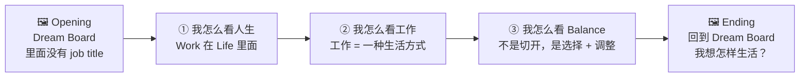

# 🌱 生活和工作应该分开吗？

> [!abstract] 一句话核心
> **I'm not trying to separate work from life.**
> **I'm trying to put work in the right place within my life.**
> 不分开 ≠ Work = Life。我讲的是：**Work 应该放在 Life 的哪里**。

---

## 🗺️ 整场逻辑一眼看完

| 段落 | 时间 | 关键句 | 支持证据 |
|---|---|---|---|
| 🖼️ Opening | 0:00–0:50 | 我想的不是「我要有什么工作」，而是「我想怎样生活」 | Dream Board + 现场提问 |
| ① 人生 | 0:50–1:50 | **Work is part of life, not the opposite of life.** | Designing Your Life · Work-life enrichment · 8-8-8 历史 |
| ② 工作 | 1:50–3:10 | 工作不是 destination，是我选择怎样生活的一种方式 | Steve Jobs connect the dots · *The 100-Year Life* |
| ③ Balance | 3:10–4:20 | 我在意的不是有没有跨线，而是**那条线是不是我画的** | Boundary Theory (segmentor vs integrator) · Self-Determination Theory |
| 🖼️ Ending | 4:20–5:00 | Work 应该怎样 fit into that life？ | Annie Dillard quote |

---

## 🔍 Part 1 — 你的观点诊断：哪里已经很强、哪里可以加强

> [!success] ✅ 已经很强的地方（保留）
> - **Dream Board 开场** — 很 personal、很 visual，而且「里面没有 job title」本身就是一个 hook
> - **你的金句**：「我想的不是我要有什么工作，而是我想怎样生活」— 这是整场的灵魂，要出现 **3 次**（开头、Point 2、结尾）
> - **Nutrition 例子** — 真实、具体，大家容易记得
> - **晚上 9 点回 message 的例子** — 很好的对比，表面一样、体验不同

> [!warning] ⚠️ 可以加强的 5 个地方
>
> | # | 问题 | 怎样优化 |
> |---|---|---|
> | 1 | GPT 版本**太长**（念完大概 7–8 分钟） | 精简到约 1,100 字，下面的 script 已经帮你砍好 |
> | 2 | 对方最容易攻击：「不分开 = 工作吃掉生活？」 | **开场就先讲清楚**：不分开 ≠ Work = Life（先堵住漏洞） |
> | 3 | 观点比较多是「我觉得」，少了外部支持 | 每个 Point 加 **1 个理论 / 研究 + 1 句名人 quote** |
> | 4 | Lead & Pace 不够明显 | 开场加一个**举手问题**，让观众先代入自己的生活 |
> | 5 | 「人生阶段」观点没用到 | 放进 Point 3：Work 的位置会随人生阶段移动 |

> [!tip] 💡 最重要的 reframe：换一个画面
> ⚖️ **天平（Balance）** = Work 一边、Life 一边，一边多另一边就少
> 🥧 **圆饼 / Dashboard** = Work 是 Life 里面的其中一块，大小可以调
>
> 👉 整场 talk 其实就是在说：**把天平换成圆**。这个画面也是之后动态图形的主视觉。

---

## 📚 Part 2 — 支持证据工具箱

### ① 支持「Work 本来就在 Life 里面」

> [!note] 📖 Book — *Designing Your Life* (Bill Burnett & Dave Evans, Stanford, 2016)
> **Health / Work / Play / Love Dashboard**：用 4 个仪表盘看自己现在的人生。
> 👉 重点不是人生只有 4 样，而是 **Work 只是其中一格，不是对面**。

> [!note] 🔬 Theory — Work-Life Enrichment (Greenhaus & Powell, 2006, *Academy of Management Review*)
> 一个角色里得到的 **skills、心情、自信、能量**，会带进另一个角色，让它变更好。
> 👉 工作和生活不只是「互相抢时间」，也会**互相加分**。

> [!note] 🔬 Theory — Life-Career Rainbow (Donald Super, 1980)
> 一个人同时扮演很多角色：孩子、学生、朋友、公民、伴侣、**工作者**……
> 👉 「工作者」只是彩虹里的其中一条颜色。

> [!example] 🕰️ 小历史（很好的 hook）
> 1817 年 **Robert Owen** 提出 **「8 小时工作、8 小时休闲、8 小时休息」**。
> 那是工厂时代，为了**保护工人**才画出来的线。
> 👉 Work vs Life 的「分开」，其实是一个**时代的产物**，不是人生本来的样子。

> [!quote] 🎤 Quote — Robert Waldinger, *Harvard Study of Adult Development*（TED, 2015）
> "Good relationships keep us happier and healthier. Period."
> 👉 追踪 80+ 年的研究：让人幸福的不是工作成就，而是**关系**。人生本来就比工作大。

### ② 支持「工作是一种生活方式，不是 destination」

> [!quote] 🎤 Quote — Steve Jobs, Stanford Commencement (2005)
> "You can't connect the dots looking forward; you can only connect them looking backwards."
> 👉 配合你的 **Nutrition 例子**：读 Nutrition 不代表只能做 nutritionist，它是一个 dot、一个 starting point。

> [!note] 📖 Book — *The 100-Year Life* (Lynda Gratton & Andrew Scott, London Business School, 2016)
> 人生不再是 **读书 → 工作 → 退休** 的三段式，而是**多段式**：可以工作、再读书、gap year、转行、50 岁再学新东西。
> 👉 完全支持你讲的「learning 没有在毕业那天结束」。

> [!note] 🔬 Theory — Job Crafting (Wrzesniewski & Dutton, 2001)
> 人不是被动接受一份工作，而是可以主动调整**任务、人际关系、对工作的看法**。
> 👉 工作是可以被「设计」进生活里的。

> [!note] 📖 Book（加分用）— *Range* (David Epstein, 2019)
> 很多成功的人不是一早就定好方向，而是试过不同领域后才找到最 fit 的。

### ③ 支持「Balance 不是 separation，而是 choice + adjustment」

> [!note] 🔬 Theory — Boundary Theory (Ashforth, Kreiner & Fugate, 2000)
> 每个人在一条光谱上：
> **Segmentor（喜欢分清楚）◀━━━━━━━━▶ Integrator（喜欢融合）**
> 两种都没有错。
>
> 🔬 **Kreiner (2006)** 的研究进一步发现：真正影响压力的，**不是分不分开**，而是**你喜欢的方式和环境给你的方式 fit 不 fit**。
> 👉 这是 Point 3 最强的学术支持！

> [!note] 🔬 Theory — Self-Determination Theory (Deci & Ryan)
> 人的 3 个基本心理需要：**Autonomy（自主）**、Competence（能力）、Relatedness（关系）。
> 👉 同样晚上回 message，「我选择的」vs「我被逼的」，感受完全不同 — 因为 **autonomy**。

> [!quote] 🎤 Quote — Jeff Bezos（2018 interview，大意）
> 他说不喜欢 "work-life balance" 这个词，因为它暗示两边是 trade-off；他比较喜欢 **work-life harmony** — "It's a circle. It's not a balance."
> 👉 跟你的「天平换成圆」完全同一个画面。

> [!note] 📊 Data — OECD Better Life Index
> OECD 把 **Work-Life Balance** 列为衡量 well-being 的其中一个维度，看的是长工时比例、以及每天有多少时间给休闲和自己。
> 👉 可以用一句带过：「连 OECD 都把它当成 well-being 的一部分 — 重点是**时间怎样分配**，不是一刀切开。」

### 🖼️ 结尾用

> [!quote] 🎤 Quote — Annie Dillard, *The Writing Life* (1989)
> **"How we spend our days is, of course, how we spend our lives."**
> 👉 每天上班的时间，本来就是我人生的时间。完美收尾。

> [!quote] 🎤（备用）Bronnie Ware, *The Top Five Regrets of the Dying*
> 临终者最常见的后悔之一：**"I wish I hadn't worked so hard."**
> 但第一名是：**"I wish I'd had the courage to live a life true to myself."**
> 👉 问题不是工作本身，而是有没有活出自己选择的生活。

---

## 🎤 Part 3 — 5 分钟 Script（v2 · 口语版）

> [!info] 这一版改了什么
> - **讲出来要像聊天**：句子短一点，加「其实、对吧、我后来想通了」这类口语
> - **英文只留你本来就会讲的**：Dream Board、family、health、project、message、gap year、exposure、skills……其他都换回中文
> - **学者名字、理论名字不用讲出来** → 放在**画面的小字**就好，嘴巴只讲白话
> - 🖼️ = 这时候出现的图（之后做动画也是用这些）　`（停）` = 停 1–2 秒

---

### 🖼️ Opening（0:00–0:50）

`🖼️ Dream Board`

大家先看一下这张图。
这是我之前做的 Dream Board。
有旅行、有朋友、有我想要的家、有大自然，也有很多我想学的东西。

可是你们有没有发现 —— **这里面，没有一个职位。**（停）

我想先问大家一个问题：
**如果让你设计你最理想的一天，那一天里面，有没有工作？**
有的可以举个手。

我自己的答案是：**有。但它只是其中一部分。**

所以每次听到「work-life balance」，我都觉得有一点怪。

![[images/01-scale-vs-circle.svg]]

好像工作放一边、生活放另一边，要秤一秤，看哪一边比较重。

所以今天的题目是：**生活和工作，应该分开吗？**

我的答案是：**对我来说，不需要刻意分开。因为工作本来就是生活的一部分。**

不过我先讲清楚 —— 不分开，**不是说工作就是我的全部。**
我想讲的是：**工作，应该放在生活的哪个位置。**

---

### ① 我怎么看人生（0:50–1:50）

其实，把工作和生活分成两边，这个想法没有很久。

![[images/02-888-clock.svg]]

差不多两百年前，工厂时代，有人提出「8 小时工作、8 小时休息、8 小时做自己的事」。
那时候是为了保护工人，才画了这条线。
但我们的人生，本来就不是这样切开的。

有一本书叫《Designing Your Life》，是 Stanford 两位老师写的。
里面有一个很简单的小练习：把人生看成四个油表 ——
**健康、工作、玩乐、爱。**
然后问自己：每一个，现在是满的，还是快没油了？

![[images/03-life-dashboard.svg]]

我很喜欢这个画法。
不是因为人生只有这四样，而是它让我一眼就看到：
**工作只是其中一个油表，它不在生活的对面。**

就好像今天星期三，我来上班，
我的身体、我的 family、我的朋友，并没有因为我在上班就暂停。
下班以后我去运动、去吃饭，
今天在工作上学到的东西，也还是我的。

而且它们是会互相影响的。
工作上学到的东西、得到的自信，会带回生活里；
生活过得开心，第二天上班也比较有力气。

所以我的第一点是：
**工作不是生活的对面，它本来就在生活里面。**

---

### ② 我怎么看工作（1:50–3:10）

那问题来了 ——
如果工作只是其中一部分，为什么我们还会花那么多时间，烦恼要选什么工作？

我后来想通了。
**选一份工作，其实不只是选一个职位，你是在选一种过日子的方式。**

![[images/04-job-explode.svg]]

你每天在什么环境、身边是什么人、
有什么 exposure、学到什么 skills、
赚多少、以后可以去到哪里 ——
这些，全部都是跟着这份工作一起来的。

像我自己，读的是 Nutrition。
但我从来不觉得：「我读 Nutrition，那我以后就只能当营养师。」

![[images/05-connect-dots.svg]]

对我来说，它比较像一个**起点**。
我可以去做食品、做产品开发、做跟健康有关的东西，
也可能以后去一个完全不一样的方向。

Steve Jobs 讲过一句话，我很喜欢。他说：
**往前看的时候，你是没办法把点连起来的；只有回头看，才知道它们是怎样连在一起的。**

而且学习也不是毕业那天就结束。

![[images/06-life-path.svg]]

现在很多人的人生，已经不是「读书、工作、退休」这样一条直线。
有人先工作再回去读书，有人 gap year，有人六十岁还在学新东西。

所以回到这张 Dream Board ——

`🖼️ Dream Board`

我想的从来不是「**我要做什么工作**」，
而是「**我想过怎样的生活**」。
然后再去找：什么样的工作，可以放进这样的生活里面。

所以我的第二点是：
**工作不是我的终点，它是我选择怎样生活、怎样成长的一种方式。**

---

### ③ 我怎么看平衡（3:10–4:20）

讲到这里，可能有人会想：
「那如果不分开，下班还在回 message，不是很累吗？」

我觉得这个担心很真实。

其实每个人本来就不一样。

![[images/07-boundary-spectrum.svg]]

有些人喜欢分得很清楚 —— 下班就是下班，周末完全不碰工作。
有些人比较不介意混在一起，想到就处理一下。
这两种，都没有对错。

有学者专门研究这件事，他们发现：
**让人累的，其实不是你有没有分开，而是你现在的方式，适不适合你自己。**

我举个例子。

![[images/08-message-9pm.svg]]

同样是晚上九点，回一个工作 message。
一个人是：「唉，我真的不想回……可是不回不行。」
另一个人是：「这个 project 我很在意，刚好看到，花五分钟回一下也没关系。」

看起来是同一件事，
但感觉，完全不一样。（停）
差别只有一个：**是不是你自己选的。**

所以我在意的，不是工作有没有「越线」，
而是 —— **那条线，是不是我自己画的。**

而且这条线是会动的。

![[images/09-work-slice.svg]]

现在的我想多学一点、多看一点，所以愿意给工作多一点位置。
过几年，也许我更想陪 family、顾好 health、去旅行，
那我就再调整。

所以我的第三点是：
**平衡不是把两边切开，而是我清楚自己现在要什么，然后去选择、去调整。**

---

### 🖼️ Ending（4:20–5:00）

`🖼️ 回到 Dream Board`

有一位作家叫 Annie Dillard，她说过一句话：
**「我们怎样过每一天，就是我们怎样过这一生。」**
我们每天上班的那八、九个小时，也是我们人生的一部分。

所以回到今天的问题：生活和工作，要分开吗？
对我来说，不需要刻意分开。

因为 ——
工作，本来就在生活里面；
选工作，其实是在选一种生活方式；
而平衡，是靠自己去选、去调整，不是一刀切开。

这张 Dream Board 以后一定会变。
我的想法会变，我想过的生活也会变，
那我的工作，当然也可以跟着变。

所以我真正想问自己的，不是「我要怎样把工作和生活分开？」
而是 ——

`🖼️ 大字：「我想怎样生活？」`

**我想怎样生活？**
然后再去想，工作要怎样放进去。

最后用一句话结束：

> **I'm not trying to separate work from life.**
> **I'm trying to put work in the right place within my life.**
> 我不是要把工作从生活里分出去，而是想把它放在对的位置。

谢谢大家。

> [!tip] 🗣️ 排练小提醒
> 如果哪一句念起来还是不像你，**用你自己平时的讲法换掉就好** —— 意思对了就 OK。最好录音听一次，卡住的地方就是要改的地方。

---

## 🛡️ Part 4 — Debate 防守卡（对方可能会问）

> [!question]- Q1：不分开，不就会 burnout、被公司吃掉生活吗？
> **A：** 我讲的不分开 ≠ always on。研究（Kreiner, 2006）发现，压力来自「你要的方式」和「环境给你的方式」**不 fit**。所以重点是 **我有没有选择权**。像法国 2017 年的 **Right to Disconnect** 法律，本质上也是在保护这个「选择」。

> [!question]- Q2：这是不是只有条件好、有选择的人才可以这样想？
> **A：** 同意，每个人的选择空间不一样大。但 **Job Crafting** 研究发现，就算不能换工作，也可以调整做事方式、跟谁合作、怎样看待这份工作。**选择有大有小，但很少是零。**

> [!question]- Q3：你还年轻，以后有家庭可能就不会这样想？
> **A：** 对，**这就是我 Point 3 讲的**。Work 的位置会随人生阶段调整。我不是说永远要给工作很多空间，而是我会**有意识地**去调整。

> [!question]- Q4：那你是不是把工作当成人生的全部 / 身份认同？
> **A：** 刚好相反。我说工作是生活的**一部分**，就代表它**不是全部**。Harvard 80 多年的研究也发现，让人幸福的最大因素是**关系**，不是工作成就。

---

## ✨ 你的 7 句金句（排练时一定要背）

1. 我想的不是「我要做什么工作」，而是「我想过怎样的生活」。
2. 不分开，不是说工作就是我的全部。
3. 工作不是生活的对面，它本来就在生活里面。
4. 选一份工作，不只是选一个职位，你是在选一种过日子的方式。
5. 工作不是我的终点，它是我选择怎样生活、怎样成长的一种方式。
6. 那条线，是不是我自己画的？
7. **I'm not trying to separate work from life. I'm trying to put work in the right place within my life.**

---

## 🎬 Phase 2 预告 — 动态图形 Storyboard

| # | 场景 | 动画 |
|---|---|---|
| 1 | Dream Board | 图片慢慢浮现 + 问题字幕 |
| 2 | ⚖️ 天平 | Work / Life 两边摇来摇去 |
| 3 | 🕰️ 8-8-8 | 时钟切成三块 → 淡出 |
| 4 | 🥧 Dashboard | 天平**变形**成 Health / Work / Play / Love 四格 |
| 5 | 💥 Job title 爆开 | 一张名片爆开变成 9 个 icon |
| 6 | 🔗 Connect the dots | Nutrition 点连出多条路线 |
| 7 | 🛣️ 100-Year Life | 三段直线 → 多段弯曲路线 |
| 8 | ↔️ Boundary 光谱 | Segmentor ↔ Integrator 小人移动 |
| 9 | 💬 9PM message | 😩 vs 😊 两个对话框 |
| 10 | 🔄 Work 的位置会变 | 圆饼里 Work 那块变大变小 |
| 11 | 🖼️ Ending | 回到 Dream Board + 金句逐字出现 |

> [!todo] 下一步需要你提供
> - [ ] Dream Board 的图片（jpg / png）
> - [ ] 想要的风格：🌿 温暖手绘感 / ✨ 简洁 minimal / 🎨 活泼彩色？
> - [ ] 播放方式：**按键一页一页切**（配合你讲），还是**自动播放**？
